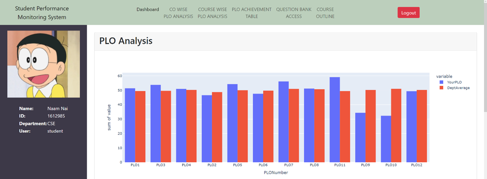
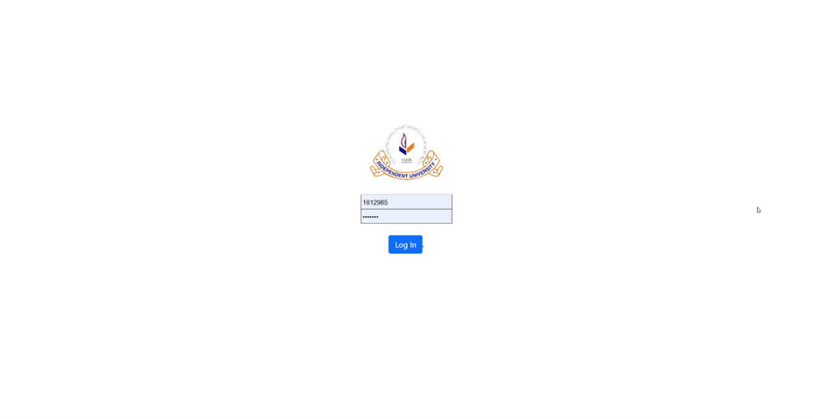
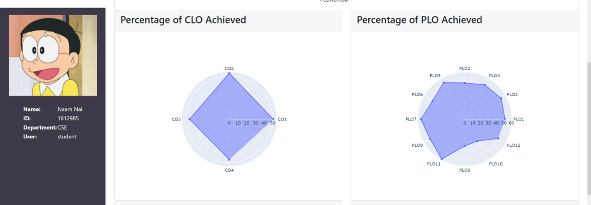
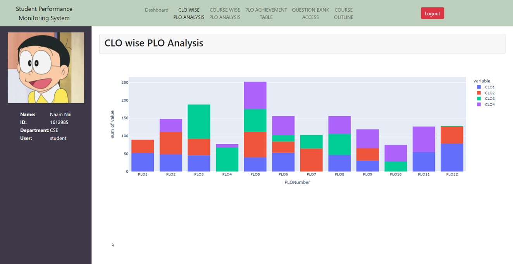
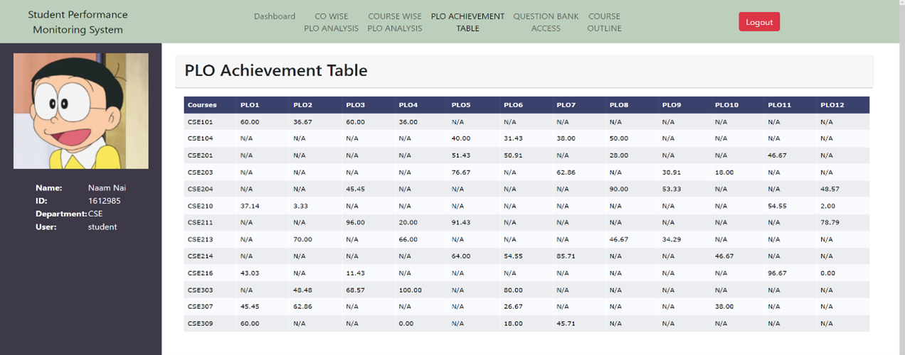
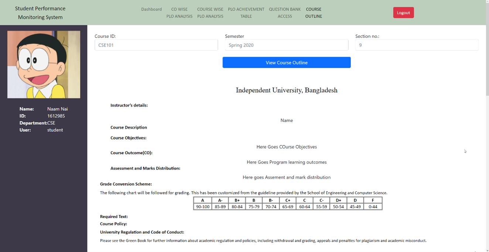

# CSE303-Autumn'22-Section-04-Group-03

# Application - Student Performace Monitoring System
A web based application written for CSE303 (Database Management) using Python (Django), Javascript, CSS and HTML. For Database we used MySQL. The objective of this application is to monitor the performance of the students at university. This can be done by the faculty members, higher authorities (Department Head, Vice Chancallor and Dean) or the student themselves. This application will monitor the performance by tracking their evaluations, assessments, marks and grades and map all these to specific Course Learning Outcomes (CLO), which itself will be mapped to different Program Learning Outcomes (PLO).

Additional features that were implemented is the Question Bank (for storing all past questions and assesments) and Course Outline Generator.

## Contributors

1.	Faiza Omar Arpita @Arpitaaa2001
2.	Injamam Ul Haque @injamam00155
3.	Istiaq Ahmed  @isti2415
4.	Jaima Jahan Khan @schatten7393
5.	Showrov Mallick @Showrov007
6.	Syed Niaz Mohtasim @syedniaz

<!-- ## Dependencies
* Python
* Django
* Pandas
* Numpy
* Plotly
* Wheel
* MySQL -->

## How to Run
1.	Clone the repository using git clone https://github.com/injamam00155/CSE303-sec-04-Group-03.git
2.	Open the terminal (or command prompt), and cd into the cloned directory.
3.	[Optional] Create a virtual environment.
4.  Use the sql script and create a database with the reqquired data.
5.  Run the following commands in the terminal:
    pip install -r req.txt
    pip install -r requirements.txt
    These commands are to Install all the prerequisites
6.	Run the command: 
    python manage.py runserver or python3 manage.py runserver
7.	Open a browser and go to the url: http://127.0.0.1:8000/

## Login Credentials
* Student:
    - Username: 1616161
    - Password: student
* Faculty:
    - Username: 4101
    - Password: faculty
* Higher Management:
    - Username: 1020
    - Password: admin

## Screenshots

